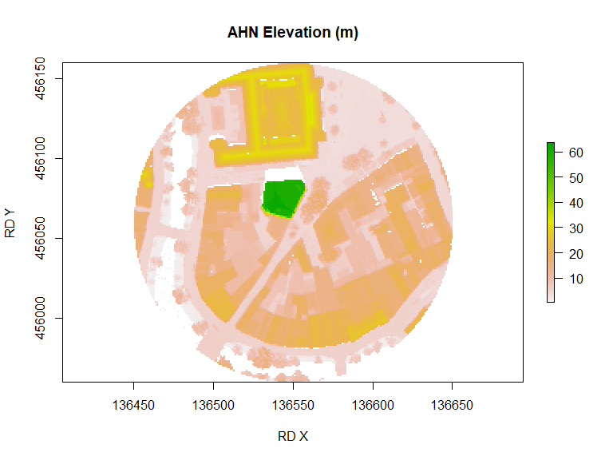
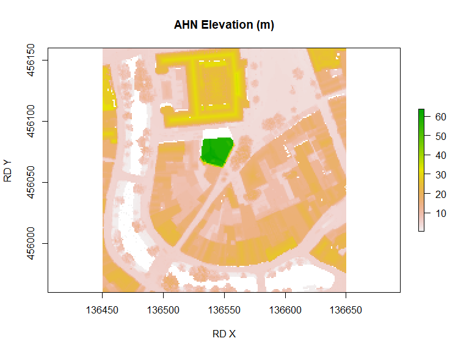
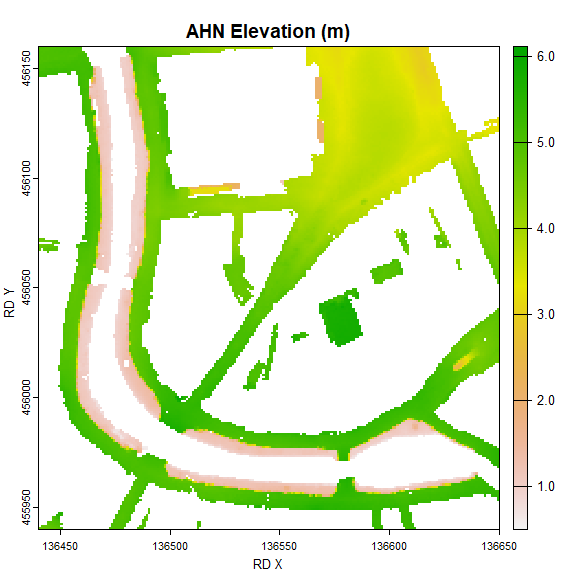
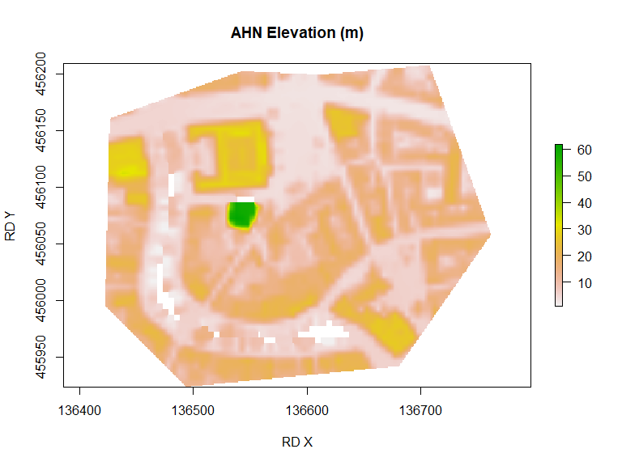
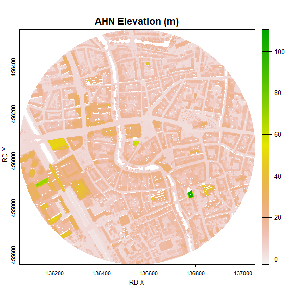
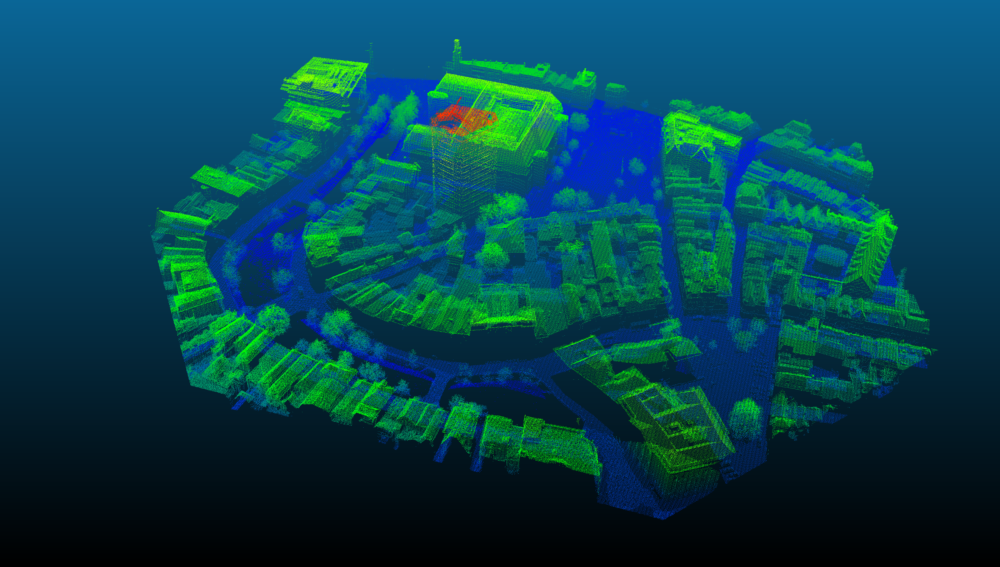
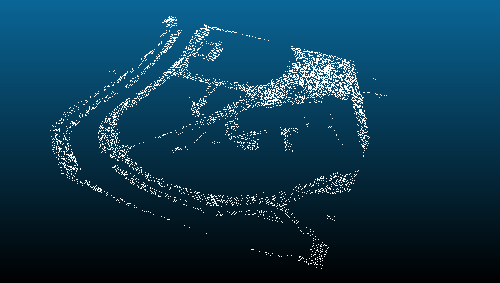

# rAHNextract

<!-- badges: start -->

[](https://www.tidyverse.org/lifecycle/#maturing)
[](https://www.gnu.org/licenses/gpl-3.0)
<!-- badges: end --> Updated: 23-04-2020

This R package automatically extracts elevation points or areas of the
Netherlands from the Actueel Hoogtebestand Nederland (AHN). Individual
elevations, raster areas or point clouds areas can be extracted from the
AHN1, AHN2 or AHN3 using all the geo services that are made available by
[PDOK](http://esrinl-content.maps.arcgis.com/apps/Embed/index.html?appid=a3dfa5a818174aa787392e461c80f781)

| Type             | AHN 3    | AHN2     | AHN1     |
| ---------------- | -------- | -------- | -------- |
| **Resolutions**  | 0.5, 5m  | 0.5m, 5m | 5m, 100m |
| **DEM**          | DSM, DTM | DSM, DTM | DTM      |
| **point clouds** | YES      | YES      | YES      |

For the AHN2 DTM, there are 2 versions available: interpolated or non
interpolated version.

For the AHN1 and AHN2 filterd (‘gefilterd’) and not filterd
(‘uitgefilterd’) versions of the point clouds datasets are made
available.

## Installation

``` r
library(devtools)
devtools::install_github("Jellest/rAHNextract")
library(rAHNextract)
```

## WCS vs. Sheets method

Retrieving individual AHN points or raster areas can be done through two
methods: WCS method or sheets method. The WCS method is the fastest
method and makes use of the OGC [WCS
protocol](https://geodata.nationaalgeoregister.nl/ahn3/wcs?request=GetCapabilities&service=wcs).
The output is a 32float GeoTIFF file. This method is only efficient if a
few AHN elevations or areas need to be retrieved.

With the sheets method, the data is retrieved from the 1km x 6.25 km
raster sheets (kaartbladen) made made available by
[PDOK](https://downloads.pdok.nl/ahn3-downloadpage/). This method is
slower as it needs to download all the sheets required to retrieve the
AHN (200-500 mb per sheet). This method is recommended to be used if
many (point) elevations need to be retrieved from a certain small area.
Other reason may be if it produces a more desired output format (regular
GeoTIFF raster).

For both the points and raster areas, the WCS method is set to default.
The sheets method can used by setting `sheets.method=TRUE`.

## Examples

The examples below show the possibilities of this package by combining
the different parameters. The different examples show how different
geometries (circles, bboxes, or custom shapes) can be retrieved with the
raster areas or point clouds. Please use the complete documentation of
the functions in R to see all the available parameters.

If desired, points or areas using the WGS coordinate system can be used
as input by setting `LONLAT=TRUE`. For efficiency and accuracy purposes,
returned raster areas are always done using the RD New coordinate system
(the source).

For `ahn_point()` and `ahn_area()` the default output is a temporary
file. Set location of directory if you want to keep the raster output
(point) using the `output.dir` parameter. The default output location
for `ahn_pc()` is always the ‘/AHN\_output’ directory in your working
directory. Working with temporary files for point clouds is strongly
discouraged due to the size of processed files.

## Individual AHN elevations points

The `ahn_point()` function returns the AHN elevation at the provided
point.

### WCS method

This examples gets the elevation from the AHN3 (default) using the DSM
(default) as the DEM.

``` r
ahn_point(name = "Utrecht point", X = 136550, Y = 456060)
#> [1] "Download raster image succeeded."
#> [1] "Intersecting raster. Getting elevation..."
#> [1] "Elevation of Utrecht point: 7.38 m."
#> [1] 7.38
```

### sheets method

The sheets method can used by setting `sheets.method=TRUE`.

This examples gets the elevation from the AHN3 DTM at the exact same
point.

``` r
ahn_point(name = "Utrecht point", X = 136550, Y = 456060, AHN = "AHN2", dem = "DTM", 
    sheets.method = TRUE)
#> [1] "The AHN sheets are loaded from or downloaded in: C:/Users/jelle/Documents/R/rAHNextract/AHN_sheets/AHN2/DTM"
#> [1] "Found 1 sheet(s) with name(s):"
#> [1] "31hz2"
#> [1] "Downloading DTM sheets..."
#> [1] "Cropping DTM sheet to (part of) the area."
#> [1] "Download and crop of DTM rasters complete."
#> [1] "Intersecting raster. Getting elevation..."
#> [1] "Elevation of Utrecht point: 4.56 m."
#> [1] 4.56
```

## AHN elevation areas

The `ahn_area()`returns the AHN elevation raster of the provided area.

### WCS method

#### circle

This example gets a circular area from the AHN3 DSM, and saving its
output raster in a custom output directory.

``` r
Utrecht_circleWCS <- ahn_area(name = "Utrecht circle", X = 136550, Y = 456060, resolution = 0.5, 
    radius = 100, output.dir = "C:/myProject")
#> [1] "Creating circle from radius input."
#> [1] "Destination directory of output AHN area: C:/myProject"
#> [1] "Download raster image succeeded."
#> [1] "C:/myProject/Utrechtcircle_100m_rAHN3_05m_DSM.tif"

plot(Utrecht_circleWCS, xlab = "RD X", ylab = "RD Y", main = "AHN Elevation (m)")
```



#### BBOX

##### BBOX using a radius from a certain point

This example gets a BBOX using a point and radius) from the AHN3 DSM.

``` r
Utrecht_WCSsBBOX <- ahn_area(name = "Utrecht sBBOX", X = 136550, Y = 456060, radius = 100, 
    bbox = TRUE, resolution = 0.5)
#> [1] "Creating bbox from point and radius input."
#> [1] "Download raster image succeeded."
plot(Utrecht_WCSsBBOX, xlab = "RD X", ylab = "RD Y", main = "AHN Elevation (m)")
```



##### BBOX using BBOX coordinates

This example makes a bbox using BBOX coordinates from the AHN3 DTM (not
interpolated version).

``` r
Utrecht_WCSBBOX <- ahn_area(name = "Utrecht BBOX", bbox = c(136450, 455960, 136650, 
    456160), dem = "DTM", resolution = 0.5, interpolate = FALSE)
#> [1] "Creating BBOX from BBOX coordinates."
#> [1] "Download raster image succeeded."
plot(Utrecht_WCSBBOX, xlab = "RD X", ylab = "RD Y", main = "AHN Elevation (m)")
```



#### Using a custom geometry shape

This example retrieves the AHN area of a custom shape area from the 5m
resolution DSM of the AHN3.

``` r
library(sf)
Utrecht.shp <- sf::st_read("C:/myProject/Utrecht_oudegracht.shp")
#> Reading layer `Utrecht_oudegracht' from data source `C:\myProject\Utrecht_oudegracht.shp' using driver `ESRI Shapefile'
#> Simple feature collection with 1 feature and 1 field
#> geometry type:  POLYGON
#> dimension:      XY
#> bbox:           xmin: 136422 ymin: 455924.1 xmax: 136762 ymax: 456208.3
#> proj4string:    +proj=sterea +lat_0=52.1561605555556 +lon_0=5.38763888888889 +k=0.9999079 +x_0=155000 +y_0=463000 +ellps=bessel +units=m +no_defs

Utrecht_WCSpolygon <- ahn_area(name = "Utrecht polygon", polygon = Utrecht.shp, resolution = 5)
#> [1] "Creating area from custom geometry."
#> [1] "Download raster image succeeded."
plot(Utrecht_WCSpolygon, xlab = "RD X", ylab = "RD Y", main = "AHN Elevation (m)")
```



### Sheets method

The sheets method can used by setting `sheets.method=TRUE`.

This example gets a BBOX with a point and radius) from the AHN2 DSM
(default). This particular and bigger BBOX intersects with 2 sheets and
are both automatically downloaded and processed before it is merged into
one raster output. The AHN sheets will be saved (or loaded) in the
‘AHN\_sheets’ directory in a own set diretory.

``` r
Utrecht_sCircle <- ahn_area(name = "Utrecht scircle", X = 136550, Y = 456060, radius = 500, 
    AHN = "AHN2", sheets.method = TRUE, sheets.location = "C:/myProject")
#> [1] "Creating circle from radius input."
#> [1] "Found 2 sheet(s) with name(s):"
#> [1] "31hn2"
#> [1] "31hz2"
#> [1] "Downloading DSM sheets..."
#> [1] "Cropping DSM sheet to (part of) the area."
#> [1] "Downloading DSM sheets..."
#> [1] "Cropping DSM sheet to (part of) the area."
#> [1] "Merging all DSM rasters..."
#> [1] "Download merge and crop of DSM rasters complete."
plot(Utrecht_sCircle, xlab = "RD X", ylab = "RD Y", main = "AHN Elevation (m)")
```



## Point clouds areas

The `ahn_pc()` function extracts the point clouds from a provided area.
The output is LAS data compressed in a .laz file of the area.

AHN3 only has one point clouds dataset available. The AHN1 and AHN2 both
have 2 versions: filtered (‘gefilterd’) and not filtered
(‘uitgefilterd’). Default is `gefilterd=TRUE`.

For all point clouds downloads you can extract the exact same geometry
shapes as used for raster areas using the same parameters described
above. (X, Y, radius, bbox, shape).

Extracting point clouds will always be done using point clouds sheets
provided by the [PDOK](https://downloads.pdok.nl/ahn3-downloadpage/).
These are often large files and will by default be downloaded and kept
on your machine in your working directory under ‘/AHN\_sheets’ or a new
‘/AHN\_sheets’ directory in your sheet download folder through the
`sheets.location` parameter. Set `sheets.keep=FALSE` if you want to
delete the downloaded point clouds sheets after the function has
finished running. Warning: Extracting point clouds area require a lot of
memory and time to be processed.

### AHN3

This example retrieves the AHN point clouds of a custom shape area from
the AHN3.

The output .laz data was imported in the program
[CloudCompare](https://www.danielgm.net/cc/) to generate the images of
the .laz data.

``` r
### AHN3
library(sf)
Utrecht.shp <- sf::st_read("C:/myProject/Utrecht_oudegracht.shp")
#> Reading layer `Utrecht_oudegracht' from data source `C:\myProject\Utrecht_oudegracht.shp' using driver `ESRI Shapefile'
#> Simple feature collection with 1 feature and 1 field
#> geometry type:  POLYGON
#> dimension:      XY
#> bbox:           xmin: 136422 ymin: 455924.1 xmax: 136762 ymax: 456208.3
#> proj4string:    +proj=sterea +lat_0=52.1561605555556 +lon_0=5.38763888888889 +k=0.9999079 +x_0=155000 +y_0=463000 +ellps=bessel +units=m +no_defs

Utrecht_shape_pc <- ahn_pc(name = "Utrecht polygon pc", polygon = Utrecht.shp)
#> [1] "The AHN sheets are loaded from or downloaded in: C:/Users/jelle/Documents/R/rAHNextract/AHN_sheets/AHN3/PC"
#> [1] "Creating area from custom geometry."
#> [1] "Destination directory of output point clouds area: AHN_output"
#> [1] "Found 1 sheet(s) with name(s):"
#> [1] "31hz2"
#> [1] "Downloading point cloud sheets..."
#> [1] "https://download.pdok.nl/rws/ahn3/v1_0/laz/C_31HZ2.LAZ"
#> [1] "Filter string: -keep_xy 136421 455924 136762 456209"
#> [1] "writing .laz"
#> [1] "C:/Users/jelle/Documents/R/rAHNextract/AHN_sheets/AHN3/PC/C_31HZ2.LAZ"
```



### AHN2 and AHN1

This example retrieves the AHN point clouds of a BBOX area from the not
filtered AHN2 (uitgefilterd). No custom output directory has been set,
and therefore the working directory wil be used for the output .laz
file. The point clouds sheets parameter is also not set, and therfore
is/are loaded in the default ‘AHN\_sheets’ directory.

``` r
Utrecht_BBOX_pc <- ahn_pc(name = "Utrecht BBOX pc", bbox = c(136450, 455960, 136650, 
    456160), AHN = "AHN2", gefilterd = TRUE)
#> [1] "The AHN sheets are loaded from or downloaded in: C:/Users/jelle/Documents/R/rAHNextract/AHN_sheets/AHN2/PC"
#> [1] "Creating BBOX from BBOX coordinates."
#> [1] "Destination directory of output point clouds area: AHN_output"
#> [1] "Found 1 sheet(s) with name(s):"
#> [1] "31hz2"
#> [1] "Downloading point cloud sheets..."
#> [1] "https://geodata.nationaalgeoregister.nl/ahn2/extract/ahn2_gefilterd/g31hz2.laz.zip"
#> [1] "Filter string: -keep_xy 136450 455960 136650 456160"
#> [1] "writing .laz"
#> [1] "C:/Users/jelle/Documents/R/rAHNextract/AHN_sheets/AHN2/PC/g31hz2.laz"
```


