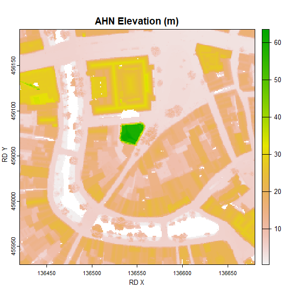
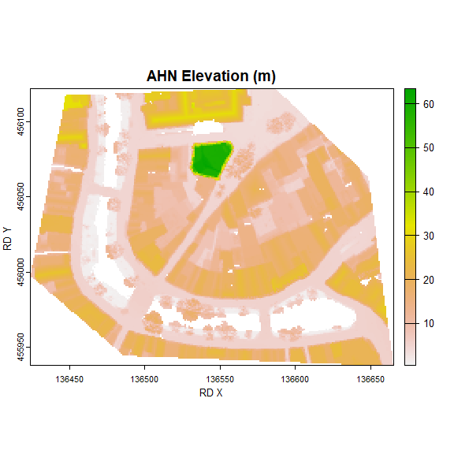

# rAHNextract

<!-- badges: start -->

[](https://www.tidyverse.org/lifecycle/#maturing)
<!-- badges: end -->

Updated: 16-04-2024

This R package automatically extracts elevation points or areas of the
Netherlands from the Actueel Hoogtebestand Nederland (AHN) datasets
collected by [AHN](https://www.ahn.nl/). Individual elevations, and
elevation raster areas can be extracted from the AHN4 using the geo and
atom web services that are made available by
[PDOK](https://www.pdok.nl/introductie/-/article/actueel-hoogtebestand-nederland-ahn).
PDOK only makes the most recent AHN available. Currently this is version
AHN4. The next release will also support the older versions of AHN which
are made available elsewhere.

| Type             | AHN5                                 | AHN4         | AHN 3               | AHN2                | AHN1                     |
|------------------|--------------------------------------|--------------|---------------------|---------------------|--------------------------|
| **Resolutions**  | waiting for data completion          | 0.5 m, 5 m\* | support will follow | support will follow | support may never follow |
| **DEM**          | waiting for data completion          | DSM, DTM     | support will follow | support will follow | support may never follow |
| **point clouds** | support may come in a future release |              |                     |                     |                          |

\*support for 5 m. resolution for AHN4 will follow.

Please refer to the quality documentation
[provided](https://www.ahn.nl/kwaliteitsbeschrijving) (in Dutch only)
for all the details about the data. AHN is the the organisation that
collects AHN data. \## 1. Installation

To download the`rAHNextract` package from GitHub, the library `devtools`
is required. If you want to compile the code from the source code, the
program Rtools is needed. Rtools is not required to make use of the
`rAHNextract` package. To plot rasters using `plot()` the `terra`
package is required.

``` r
library(devtools)
devtools::install_github("Jellest/rAHNextract")
library(rAHNextract)
library(terra)
```

Please see
[here](https://jellest.github.io/rAHNextract/reference/ahn_area.html)
all the parameters available for `ahn_area()` and
[here](https://jellest.github.io/rAHNextract/reference/ahn_point.html)
for `ahn_point()`

## 2. WCS vs. Sheets method

Retrieving individual AHN elevation points or elevation raster areas can
be retrieved through two methods: WCS method or sheets method. The WCS
method is the fastest method and makes use of the OGC [WCS
protocol](https://www.pdok.nl/ogc-webservices/-/article/actueel-hoogtebestand-nederland-ahn).
The output is a GeoTIFF file. This method is only efficient if a few AHN
elevations or areas need to be retrieved.

With the sheets method, the data is retrieved from the 1km x 6.25 km
raster sheets (kaartbladen) made made available by
[PDOK](https://www.pdok.nl/atom-downloadservices/-/article/actueel-hoogtebestand-nederland-ahn).
This method is slower as it needs to download all the sheets required to
retrieve the AHN (200-500 mb per sheet). This method is recommended to
be used if many (point) elevations need to be retrieved from a certain
small area.

For both the points and raster areas, the WCS method is set to default.
The sheets method can used by setting `sheets.method = TRUE`.

## 3. Method of elevation extraction

Extraction of the elevation is done based on the raster data it receives
from the sources. Determining the elevation can be tricky if no correct
resampling is applied. The script always ensures a correct resampling
takes place by adjusting the raster cells that need to be downloaded
whenever necessary. This is called a ‘rectified grid.’ To avoid issues,
the interpolation on the rectified grid raster to determine the
elevation is always done in the script and not through a OGC method
online. Please refer to
[this](https://geoforum.nl/t/wcs-van-ahn3-werkt-een-bounding-box-als-clip/6122/4)
why it is important to always use rectified grids.

Please refer to [this](https://gisgeography.com/raster-resampling/) to
read between the different extraction methods allowed: ‘simple’
(nearest) or ‘bilinear’. In this package the default for the
`extraction.method` parameter is set to ‘simple’.

## 4. Examples

The examples below show the possibilities of this package by combining
the different parameters. The different examples show how different
geometries (circle, bbox, or custom polygon) can be retrieved with the
raster areas. Please use the complete documentation of the functions in
R to see all the available parameters.

If desired, points or areas using the WGS84 coordinate system (Longitude
and Latitude coordinates) can be used as input by setting
`LONLAT = TRUE`. For efficiency and accuracy purposes, returned raster
areas are always done using the RD New coordinate system (the source).

For `ahn_point()` and `ahn_area()` the default output is a temporary
file. Set location of directory if you want to keep the raster output
(point) using the `output.dir` parameter.

### 4.1 Individual AHN elevations points

The `ahn_point()` function returns the AHN elevation at the provided
point.

#### 4.1.1 WCS method

This examples gets the elevation from the AHN (default) using the DSM
(default) as the DEM. Changing the DEM type can be adjusted through the
`dem` parameter(“DTM”, or “DSM”)

``` r
ahn_point(X = 136544, Y = 456070)
#> [1] "https://service.pdok.nl/rws/ahn/wcs/v1_0/?&SERVICE=WCS&VERSION=1.0.0&REQUEST=GetCoverage"
#> [1] "Download raster image succeeded."
#> [1] "Intersecting raster. Getting elevation..."
#> [1] "Elevation of AHNelevation: 63.57 m."
#> [1] 63.57
```

#### 4.1.2 sheets method

The sheets method can used by setting `sheets.method = TRUE`. AHN sheets
are always stored by default in the {current working
directory}/AHN_output/AHN_sheets but can be adjusted using the
`sheets.dir` parameter. The sheets will always be stored under the
‘AHN_sheets’ folder under the used AHN and DEM.

This examples gets the elevation from the AHN DSM at the exact same
point.

``` r
ahn_point(name = "Utrecht point", X = 136550, Y = 456060, AHN = "AHN", dem = "DTM", sheets.method = TRUE)
#> [1] "The AHN sheets are loaded from or downloaded in: C:/Users/jelle/stack/GitHub/rAHNextract/rAHNextract_dev/AHN_sheets. If no AHN sheet in the correct directory or if no correct name of AHN sheet is found, sheet will be downloaded. For first use it is recommended to use the default output directory."
#> [1] "Destination directory of output AHN sheet M_31HZ2.tif: C:/Users/jelle/stack/GitHub/rAHNextract/rAHNextract_dev/AHN_sheets/AHN4/DTM"
#> [1] "Intersecting raster. Getting elevation..."
#> [1] "Elevation of Utrecht point: 4.60 m."
#> [1] 4.6
```

Please see [here]() all the parameters available for `ahn_point()`

### 4.2 AHN elevation areas

The `ahn_area()`returns the AHN elevation raster of the provided area.

#### 4.2.1 WCS method

##### 4.2.1.1 circle

This example gets a circular area from the AHN DSM, and saving its
output raster in a custom output directory.

``` r
Utrecht_circleWCS <- ahn_area(name = "Utrecht circle", X = 136544, Y = 456070, resolution = 0.5, radius = 130, output.dir = "C:/myProject")
#> [1] "Creating circle from single X,Y point and a radius input."
#> [1] "Destination directory of output AHN area: C:/myProject"
#> [1] "Download raster image succeeded."

plot(Utrecht_circleWCS, xlab = "RD X", ylab = "RD Y", main = "AHN Elevation (m)")
```


##### 4.2.1.2 BBOX

###### 4.2.1.2.1 BBOX using a radius from a certain point

This example gets a BBOX (using a point and radius) from the AHN DSM.

``` r
Utrecht_WCSsBBOX <- ahn_area(name = "Utrecht rBBOX", X = 136550, Y = 456060, radius = 130, bbox = TRUE, resolution = 0.5)
#> [1] "Creating bbox from X,Y point and radius input."
#> [1] "Download raster image succeeded."
plot(Utrecht_WCSsBBOX, xlab = "RD X", ylab = "RD Y", main = "AHN Elevation (m)")
```



###### 4.2.1.2.2 BBOX using BBOX coordinates

This example makes a bbox using BBOX coordinates from the AHN DTM.

``` r
Utrecht_WCSBBOX <- ahn_area(name = "Utrecht BBOX", bbox = c(136440, 455940, 136650, 456160), dem = "DTM", resolution = 0.5)
#> [1] "Creating BBOX from BBOX coordinates."
#> [1] "Download raster image succeeded."
plot(Utrecht_WCSBBOX, xlab = "RD X", ylab = "RD Y", main = "AHN Elevation (m)")
```


##### 4.2.1.3 Using a custom geometry shape

This example retrieves the AHN area of a custom shape area from the 5m
resolution DSM of the AHN3.

``` r
library(sf)
Utrecht.gpkg <- sf::st_read(paste0("C:/myProject/rAHNextract_tests.gpkg"), layer = "my_polygon")
#> Reading layer `my_polygon' from data source `C:\myProject\rAHNextract_tests.gpkg' using driver `GPKG'
#> Simple feature collection with 1 feature and 0 fields
#> Geometry type: POLYGON
#> Dimension:     XY
#> Bounding box:  xmin: 136424.8 ymin: 455938.7 xmax: 136664.1 ymax: 456121.9
#> Projected CRS: Amersfoort / RD New

Utrecht_WCSpolygon <- ahn_area(name = "Utrecht polygon", polygon = Utrecht.gpkg, resolution = 0.5)
#> Simple feature collection with 1 feature and 0 fields
#> Geometry type: POLYGON
#> Dimension:     XY
#> Bounding box:  xmin: 136424.8 ymin: 455938.7 xmax: 136664.1 ymax: 456121.9
#> Projected CRS: Amersfoort / RD New
#>                             geom
#> 1 POLYGON ((136486.7 455945.3...
#> [1] "Creating area from custom geometry."
#> [1] "Download raster image succeeded."
plot(Utrecht_WCSpolygon, xlab = "RD X", ylab = "RD Y", main = "AHN Elevation (m)")
```



#### 4.2.2 Sheets method

The sheets method can used by setting `sheets.method = TRUE`.

This example gets a elevation raster in the form of a circle. This
bigger BBOX intersects with 2 sheets and are both automatically
downloaded and processed before it is merged into one raster output. The
AHN sheets will be saved (or loaded) in the ‘AHN_sheets’ directory or in
a own set directory. If an intersection is made with 3 ir 4 sheets, they
wil be downloaded as well,. Please note that downloading 4 AHN sheets
will be around 1GB of storage space.

``` r
Utrecht_sheets <- ahn_area(name = "Utrecht circle", X = 136550, Y = 456060, radius = 500, AHN = "AHN", sheets.method = TRUE, output.dir = "C:/myProject")
#> [1] "Creating circle from single X,Y point and a radius input."
#> [1] "The AHN sheets are loaded from or downloaded into: C:/myProject/AHN_sheets. If no AHN sheet(s) are found in this directory or if no correct name of AHN sheet(s) are found, the AHN sheet(s) will be downloaded."
#> [1] "https://service.pdok.nl/rws/ahn/atom/downloads/dsm_05m/R_31HZ2.tif"
#> [1] "Destination directory of output AHN sheet R_31HZ2.tif: C:/myProject/AHN_sheets/AHN4/DSM"
#> [1] "https://service.pdok.nl/rws/ahn/atom/downloads/dsm_05m/R_31HN2.tif"
#> [1] "Destination directory of output AHN sheet R_31HN2.tif: C:/myProject/AHN_sheets/AHN4/DSM"
#> [1] "Masked raster and saved on disk at: C:/myProject/Utrecht_circle_AHN4_dsm05m.tif"
plot(Utrecht_sheets, xlab = "RD X", ylab = "RD Y", main = "AHN Elevation (m)")
```


#### 4.3 Downloading only sheets

It is also possible to only download the AHN sheets. This is done by
providing a `list()` of kaartbladen nrs through the `sheets` parameter.
When setting thz`sheets` only the `AHN`, `dem` and `sheets.dir` become
relevant. AHN sheets are always stored by default in the {current
working directory}/AHN_output/AHN_sheets but can be adjusted using the
`sheets.dirt` parameter. The sheets will always be stored under the
‘AHN_sheets’ folder followed by AHN and DEM folders.

``` r
ahn_area(AHN = "AHN", dem = "DTM", sheets = list("31HN1", "31HN2"), sheets.dir = "C:/myProject")
#> [1] "The AHN sheets are loaded from or downloaded into: C:/myProject/AHN_sheets. If no AHN sheet(s) are found in this directory or if no correct name of AHN sheet(s) are found, the AHN sheet(s) will be downloaded."
#> [1] "Destination directory of output AHN sheet M_31HN1.tif: C:/myProject/AHN_sheets/AHN4/DTM"
#> [1] "Destination directory of output AHN sheet M_31HN2.tif: C:/myProject/AHN_sheets/AHN4/DTM"
#> [1] "C:/myProject/AHN_sheets/AHN4/DTM/M_31HN1.tif" "C:/myProject/AHN_sheets/AHN4/DTM/M_31HN2.tif"
```

### 5. Point clouds areas

Support for downloading point clouds is no longer available in this
release. Support may come back in a future release.
